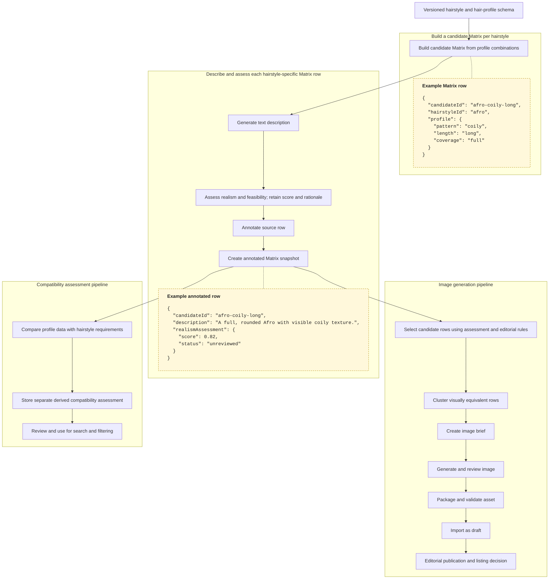

# Content-generation pipeline for hairstyle variations

**Status:** concept note; no production workflow is implied yet.

## Goal

Build a high-dimensional matrix of hairstyle and hair-profile combinations. For each combination, generate a text description and assess how realistic and feasible it is. Preserve the combination and its assessment as data; do not discard low-scoring or unknown rows at this stage.

The annotated matrix then becomes an input dataset for separate downstream workflows: image generation and compatibility assessment. A hairstyle variation may be an independently addressable hairstyle record related to a parent, but the parent/variation presentation model remains a separate decision.

## Proposed flow

The two example-data boxes are separate from the process boxes and grouped with the step they illustrate. Values and schema are illustrative, not final.

Each matrix row and its realism/feasibility assessment is retained, including low scores and unknowns. The matrix is a candidate space, not a promise to enumerate every mathematically possible combination. Constraints can keep it sparse. A later workflow decides which rows are useful for image generation; compatibility is derived separately from the annotated matrix and hairstyle requirements.

## Separate downstream workflows

### Image generation

Select rows using their stored assessment and editorial rules. Cluster rows only when one image can represent them faithfully. Record which candidate rows each image represents, then review the image and import it as draft content. A low score does not disappear from the matrix; it simply need not be selected for image generation.

### Compatibility assessment

Derive compatibility as a separate dataset from the annotated matrix and the hairstyle or variation requirements. It is not a stage or gate in image generation. Store the candidate IDs, dimensions compared, outcome, rationale, confidence, provenance, and unknown state. Compatibility rules and score thresholds remain to be designed and reviewed.

## Data to retain

- Stable candidate, hairstyle/variation, and matrix snapshot IDs.
- Schema version and normalized input dimensions, with explicit unknown and not-applicable states.
- Generated description and prompt inputs.
- Realism/feasibility score, rationale, evaluator/model version, and review status.
- For image assets: generation prompt, model/version, candidate rows represented, asset, review decision, and revision history.
- For compatibility: a separate assessment linked to candidate IDs, with dimension-level rationale, confidence, and provenance.

## Guardrails for a first prototype

- Start with a small, deliberate subset of dimensions and one hairstyle family; do not materialize the full future matrix.
- Keep original matrix inputs immutable in each snapshot; store model-generated annotations separately from source values.
- Distinguish `unknown`, `not applicable`, `implausible`, and `plausible`. A bald or sparse-coverage profile should not be forced into an ordinary length or curl category.
- Model coverage and density regionally when the use case depends on where hair remains; avoid a single ambiguous “percent of hair left” value.
- Use clustering to reduce duplicate image generation, but preserve the mapping and do not reuse one image where it misrepresents a candidate.
- Keep compatibility estimates as a separate derived product. Record rationale, confidence, and provenance; never turn a missing value into an incompatibility verdict.
- Keep source content, AI-generated suggestions, and editorial corrections distinguishable and traceable.

## Open decisions

- Which dimensions are stable enough for the first schema version, and which are too subjective or costly to collect?
- What does the realism/feasibility score mean, and how will it be calibrated or reviewed?
- What candidate-generation strategy controls matrix growth while retaining useful coverage?
- How are hairstyle variations related to parent records, and which parent fields are inherited, overridden, or copied into a variation?
- If a variation has no image, should its page use a parent image with a clear label, show no image, or remain unpublished?
- Is compatibility a normalized score, categorical outcome, or both? Which judgments need expert review?
- Which editorial flag controls detail-page publication versus inclusion in broad listings?
